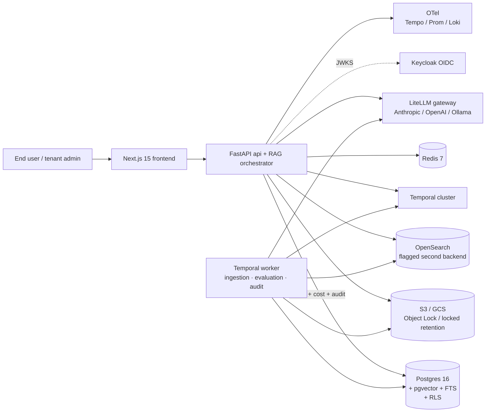

de# SentinelRAG

> **Multi-tenant, RBAC-aware, evaluation-driven enterprise RAG platform.**
> Production-shaped: Postgres + pgvector retrieval, layered hallucination
> detection, immutable audit, per-tenant cost budgets, multi-cloud
> Terraform, Helm + ArgoCD, k6 + Chaos Mesh resilience tests, daily
> backup verifiers, and 30 ADRs explaining every non-obvious choice.

[](LICENSE)
[](docs/architecture/c4/L2-container.md)
[](PROGRESS.md)

## What this is

SentinelRAG is a **portfolio-grade RAG platform** built to be readable
end-to-end by a senior engineer in 30 minutes. It is shaped like a real
multi-tenant SaaS:

- **Multi-tenancy with RLS + RBAC at retrieval time** — every Postgres
  query carries `app.current_tenant_id`; the hybrid retriever injects an
  authorized-collections CTE *before* candidates are fetched, not as a
  post-mask.
- **Hybrid retrieval** — Postgres FTS BM25 + pgvector HNSW, merged with
  Reciprocal Rank Fusion, optionally re-ranked by a self-hosted
  bge-reranker-v2-m3.
- **Layered hallucination detection** — token-overlap → NLI →
  LLM-as-judge cascade so we don't pay LLM-judge cost on every answer.
- **Per-tenant cost budgets** with soft-cap downgrade and hard-cap deny,
  enforced *before* generation.
- **Immutable audit trail** dual-written to Postgres + S3 Object Lock /
  GCS locked retention, daily reconciled by a Temporal Schedule.
- **Versioned prompts** as first-class artifacts — every answer
  persists a `prompt_version_id` so eval reports can attribute quality
  changes to specific prompt edits.

The point of the project is **the way it's built**, not just the
features. Every load-bearing decision is documented as an ADR.

## Architecture at a glance



Detailed diagrams (rendered natively on GitHub):

- [**L1 — System context**](docs/architecture/c4/L1-system-context.md) — who uses it, what it talks to.
- [**L2 — Containers**](docs/architecture/c4/L2-container.md) — deployable units + protocols.
- [**L3 — RAG core**](docs/architecture/c4/L3-component-rag-core.md) — orchestrator, retrievers, reranker, cost gate, audit.
- [**L4 — AWS deployment**](docs/architecture/c4/L4-deployment-aws.md) and [**GCP mirror**](docs/architecture/c4/L4-deployment-gcp.md).

## Where to read the rationale

- **[`AGENTS.md`](AGENTS.md)** — the canonical Codex guide: locked
  stack, session checklist, architectural pillars, and footguns.
- **[ADR catalog](docs/architecture/adr/README.md)** — 30 accepted ADRs.
  Each is one decision, short, with trade-offs spelled out and
  alternatives recorded.
- **[Progress snapshot](PROGRESS.md)** — one-page status of every phase + what's left.
- **[Phase plan](docs/architecture/PHASE_PLAN.md)** — full live ledger of what's shipped, what's next, what was deferred and why.
- **Operations runbooks** in [`docs/operations/runbooks/`](docs/operations/runbooks/):
  - [Deploy on AWS](docs/operations/runbooks/deployment-aws.md) — fresh account → live URL (~90 min)
  - [Deploy on GCP](docs/operations/runbooks/deployment-gcp.md) — fresh project → live URL (~75 min)
  - [Cluster bootstrap](docs/operations/runbooks/cluster-bootstrap.md) — shared in-cluster pieces (cert-manager, ESO, Temporal, ArgoCD)
  - [Local development](docs/operations/runbooks/local-development.md) — beyond-quick-start workflow + troubleshooting
  - [Feature testing guide](docs/operations/runbooks/testing-guide.md) — per-feature manual + automated test matrix
  - [Disaster recovery](docs/operations/runbooks/disaster-recovery.md) — RPO/RTO matrix, 8 failure scenarios with step-by-step recovery
- Original PRD + design docs (kept for historical context, **superseded
  by ADRs where they conflict** — see AGENTS.md "Decision overrides"):
  [PRD](Enterprise_RAG_PRD.md), [Architecture](Enterprise_RAG_Architecture.md),
  [Database design](Enterprise_RAG_Database_Design.md), [Deployment](Enterprise_RAG_Deployment.md),
  [Folder structure](Enterprise_RAG_Folder_Structure.md).

## Stack (locked — every choice has an ADR)

| Layer | Choice |
|---|---|
| Language | Python 3.12 (services), TypeScript 5.x (frontend, SDK) |
| Backend | FastAPI + Pydantic v2 + SQLAlchemy 2.0 async + asyncpg |
| Frontend | Next.js 15 App Router + NextAuth + shadcn/ui + Tailwind + TanStack Query |
| Vector store | Postgres 16 + pgvector with **HNSW** ([ADR-0003](docs/architecture/adr/0003-pgvector-hnsw.md)) |
| Keyword search | **Postgres FTS** v1; **OpenSearch** as flagged Phase-8 alternative ([ADR-0004](docs/architecture/adr/0004-postgres-fts-over-opensearch.md), [ADR-0026](docs/architecture/adr/0026-opensearch-reintroduction.md)) |
| Cache | Redis 7 |
| Object storage | S3 / GCS with Object Lock COMPLIANCE / locked retention ([ADR-0015](docs/architecture/adr/0015-raw-text-in-object-storage.md), [ADR-0016](docs/architecture/adr/0016-immutable-audit-dual-write.md)) |
| LLM gateway | LiteLLM ([ADR-0005](docs/architecture/adr/0005-litellm-gateway.md)) |
| Default LLM | Ollama Llama 3.1 8B; OpenAI / Anthropic via env-flag opt-in ([ADR-0014](docs/architecture/adr/0014-hybrid-llm-strategy.md)) |
| Reranker | bge-reranker-v2-m3 self-hosted; Cohere as adapter ([ADR-0006](docs/architecture/adr/0006-bge-reranker.md)) |
| Workflow engine | **Temporal** self-hosted (overrides spec's Celery; [ADR-0007](docs/architecture/adr/0007-temporal-over-celery.md)) |
| Auth | Keycloak self-hosted + OAuth2/JWT ([ADR-0008](docs/architecture/adr/0008-keycloak-auth.md)) |
| Inter-service comms | REST + Pydantic v2 contracts ([ADR-0009](docs/architecture/adr/0009-rest-not-grpc.md)) |
| Hallucination detection | Layered: token-overlap → NLI → LLM-judge sample ([ADR-0010](docs/architecture/adr/0010-layered-hallucination-detection.md)) |
| Feature flags | Unleash self-hosted ([ADR-0018](docs/architecture/adr/0018-feature-flags-unleash.md)) |
| Eval framework | `ragas` + custom evaluators ([ADR-0019](docs/architecture/adr/0019-evaluation-framework-ragas.md)) |
| Observability | OpenTelemetry → OTel Collector → Tempo (traces) + Prometheus (metrics) + Loki (logs) |
| K8s deployment | Helm chart + ArgoCD GitOps ([ADR-0012](docs/architecture/adr/0012-helm-argocd-deployment.md), [ADR-0023](docs/architecture/adr/0023-helm-chart-shape.md)) |
| Cloud scope | AWS primary, GCP mirror, Azure ADR-only ([ADR-0011](docs/architecture/adr/0011-multi-cloud-strategy.md), [ADR-0025](docs/architecture/adr/0025-gcp-parity.md)) |
| DR | RPO/RTO matrix, active-passive cross-cloud, daily backup verifier ([ADR-0028](docs/architecture/adr/0028-disaster-recovery.md)) |
| Resilience tests | k6 (SLO-bound) + Chaos Mesh ([ADR-0027](docs/architecture/adr/0027-load-and-chaos-testing.md)) |

## Repository tour

```
.
├── apps/
│   ├── api/                  # FastAPI service + in-process RAG orchestrator
│   ├── temporal-worker/      # Workflows: ingestion, evaluation, audit reconciliation
│   ├── frontend/             # Next.js 15 dashboard
│   ├── ingestion-service/    # carved out for Phase 8+ split
│   ├── retrieval-service/    # same
│   └── evaluation-service/   # same
├── packages/
│   └── shared/python/        # Cross-service: auth, contracts, errors, telemetry,
│                             #   logging, retrieval, evaluation, audit, object_storage
├── migrations/               # Alembic, hand-written, no autogenerate
├── infra/
│   ├── helm/sentinelrag/     # Single chart deploys api + worker + frontend
│   ├── terraform/aws/        # 8 modules + dev env (VPC, EKS, RDS, ElastiCache,
│   │                         #   S3, Secrets Manager, IAM IRSA, OpenSearch)
│   ├── terraform/gcp/        # 7 modules + dev env (mirror; Workload Identity)
│   ├── observability/        # Grafana dashboards-as-code, OTel collector config
│   └── chaos/                # Chaos Mesh experiments + game-day Workflow
├── tests/
│   ├── performance/k6/       # smoke / baseline / soak / spike with SLO thresholds
│   ├── performance/evals/    # before/after comparison eval harness (Phase 9)
│   ├── contract/
│   └── security/
├── scripts/
│   ├── dr/                   # AWS + GCP backup verifiers
│   ├── seed/                 # Demo tenant + sample documents
│   ├── cost/                 # Synthetic-month cost-report generator
│   └── local/                # Keycloak / Temporal / observability bootstrap
├── docs/
│   ├── architecture/
│   │   ├── PHASE_PLAN.md     # Live build status
│   │   ├── adr/              # 30 ADRs
│   │   └── c4/               # L1-L4 Mermaid diagrams
│   └── operations/
│       └── runbooks/         # deployment, bootstrap, testing, DR, local dev
└── .github/workflows/
    ├── ci.yml                # lint + typecheck + unit
    ├── security.yml          # tfsec + bandit + trivy fs/image
    ├── perf-smoke.yml        # k6 smoke against deployed dev
    └── dr-backup-verify.yml  # daily AWS + GCP backup health
```

## Deploy to a real cloud

The end-to-end procedures live under [`docs/operations/runbooks/`](docs/operations/runbooks/):

- [`deployment-aws.md`](docs/operations/runbooks/deployment-aws.md) — fresh AWS account → live URL serving a query (~90 min, ~$200-$300/mo idle)
- [`deployment-gcp.md`](docs/operations/runbooks/deployment-gcp.md) — fresh GCP project → live URL (~75 min, ~$250-$350/mo idle)
- [`cluster-bootstrap.md`](docs/operations/runbooks/cluster-bootstrap.md) — the shared in-cluster Helm stack (cert-manager, ESO, Temporal, ArgoCD)

The chart and Terraform are the same artifact across clouds (per ADR-0011 + ADR-0025); only the values overlay and per-cloud bootstrap quirks differ.

## Quick start (local stack)

```bash
# 1. Install uv: https://docs.astral.sh/uv/
uv sync --all-packages

# 2. Bring up the local stack (Postgres + pgvector, Redis, MinIO, Keycloak,
#    Temporal, Ollama, OTel + Grafana + Prometheus + Loki).
make up

# 3. Run migrations and seed the demo tenant.
make db-upgrade
make seed

# 4. Start the API with hot reload.
make api

# 5. Start the frontend (separate terminal).
cd apps/frontend && npm install && npm run dev

# 6. Hit the API.
curl -H "Authorization: Bearer dev" \
     -H "Content-Type: application/json" \
     -d '{"query":"How does RBAC work?","collection_ids":["<uuid>"]}' \
     http://localhost:8000/api/v1/query
```

The `dev` token only works locally — it's gated by **two** flags
(`ENVIRONMENT=local` AND `AUTH_ALLOW_DEV_TOKEN=true`) and a unit test
verifies it's never accidentally enabled in dev/staging/prod.

## Build status

**All 10 phases are code-side complete.** The deployment runbooks at
[`docs/operations/runbooks/deployment-aws.md`](docs/operations/runbooks/deployment-aws.md)
and [`docs/operations/runbooks/deployment-gcp.md`](docs/operations/runbooks/deployment-gcp.md)
walk through the fresh-account-to-live-URL procedure end-to-end. The
in-cluster bootstrap stack (cert-manager, ESO, Temporal, ArgoCD,
optional Chaos Mesh) ships as committed Helm values overlays under
[`infra/bootstrap/`](infra/bootstrap/) plus an
[ArgoCD Application manifest](infra/bootstrap/argocd/applications/) per
cloud. Image build pipeline lives at
[`.github/workflows/build-images.yml`](.github/workflows/build-images.yml).

What still needs running infra (and is therefore not "shipped" in the
repo): the first `terraform apply` against a real account, real-traffic
eval/cost numbers in `docs/operations/{eval,cost}-report.md`, drill-recorded
RTO numbers, and the 5-minute demo video.

See [`docs/architecture/PHASE_PLAN.md`](docs/architecture/PHASE_PLAN.md)
for the live shipping log.

## Things-not-to-do (recurring footguns)

These rules are encoded in AGENTS.md and tested where possible:

- **Don't mock the DB in tests that exercise RLS, tenancy, or RBAC retrieval** — the bug surface is in real Postgres behavior. Integration tests use testcontainers.
- **Don't store raw document text in Postgres** — push to object storage, keep `storage_uri` (ADR-0015).
- **Don't write Celery code** — Temporal workflows + activities only (ADR-0007 overrides spec).
- **Don't put inline prompt strings in service code** outside of seeded defaults — go through `PromptService`.
- **Don't add cloud-specific code to K8s manifests** — use Helm values overrides.
- **Don't trust an embedding `vector` column's hardcoded dimension** when introducing new models (ADR-0020).

## License

MIT — see [LICENSE](LICENSE).
