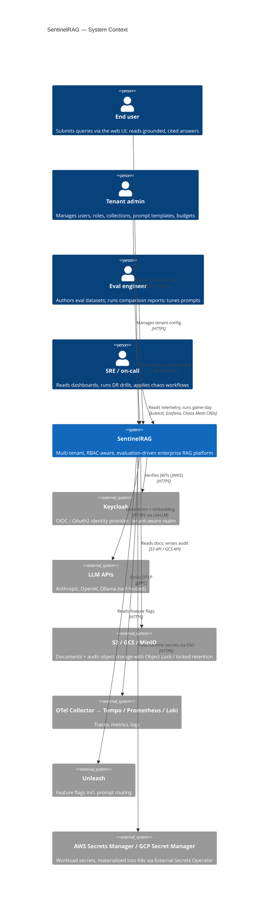

# C4 L1 — System Context

SentinelRAG as a single box, with the people and external systems it talks to.

## Key rules visible at this level

- **End-to-end identity flow.** Every user request carries a Keycloak JWT; the `tenant_id` claim binds the request to a Postgres RLS context.
- **Audit dual-write reaches outside the box.** Object storage with Object Lock is part of the perimeter — it's how immutability is enforced (ADR-0016).
- **LLM calls are external dependencies, not in-process.** Routed through a single LiteLLM gateway so cost accounting is uniform regardless of provider (ADR-0005).

## Related ADRs

- [ADR-0008](../adr/0008-keycloak-auth.md) — Keycloak self-hosted
- [ADR-0014](../adr/0014-hybrid-llm-strategy.md) — Hybrid LLM strategy (Ollama default, OpenAI / Anthropic opt-in)
- [ADR-0016](../adr/0016-immutable-audit-dual-write.md) — Audit dual-write
- [ADR-0018](../adr/0018-feature-flags-unleash.md) — Unleash for feature flags
