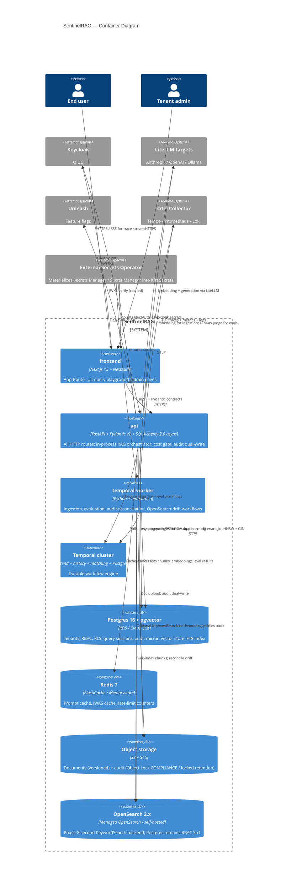

# C4 L2 — Container Diagram

The deployable units inside SentinelRAG and the protocols between them.

## Why containers split this way

- **`api` is the cost-and-RBAC chokepoint.** Every privileged action passes through it; this is what makes the audit trail credible. The orchestrator runs in-process (ADR-0021) so the chokepoint and the work are co-located.
- **`temporal-worker` is the only place activities run.** Three task queues — `ingestion`, `evaluation`, `audit` — share one worker process today; production may split.
- **`opensearch` is optional.** ADR-0026: it's a flagged second backend behind the same `KeywordSearch` protocol. Postgres FTS is the always-on backend; OpenSearch is A/B-able.
- **`temporal` is its own cluster.** Self-managed via the upstream Helm chart, NOT bundled into the SentinelRAG chart (ADR-0023) — its sub-chart graph is too heavy.

## Inter-container protocols

| Pair | Protocol | Why |
|---|---|---|
| frontend → api | REST + Pydantic v2 contracts | ADR-0009 (overrides spec's gRPC). Same wire shape as we'd publish to third-party SDK. |
| api → temporal | Temporal SDK | Native client. Workflows are durable, type-safe across language runtimes. |
| api → object_store | S3 API (AWS) / GCS API (GCP) | Same SDK shape via `boto3` / `google-cloud-storage`. Provider switch is a values-overlay change. |
| api → postgres | asyncpg | Async-native. Pool sized to match `max_concurrent_workflow_tasks` × `worker.replicas`. |
| api → litellm targets | LiteLLM HTTP | One library, every provider. Cost + token accounting in one place. |

## Related ADRs

- [ADR-0009](../adr/0009-rest-not-grpc.md) — REST + Pydantic over gRPC
- [ADR-0021](../adr/0021-retrieval-embedded-v1.md) — Retrieval embedded in `api` for v1
- [ADR-0023](../adr/0023-helm-chart-shape.md) — Helm chart shape (which containers ship in the chart)
- [ADR-0026](../adr/0026-opensearch-reintroduction.md) — OpenSearch as parallel adapter
