# C4 L3 — RAG Core (component diagram)

A zoom into the `api` container's RAG path: the in-process orchestrator and the components it composes for a single `POST /api/v1/query` request.

```mermaid
C4Component
    title api — RAG Core component diagram

    Container_Boundary(api, "api (FastAPI process)") {
      Component(routes, "QueryRoute", "FastAPI router", "POST /query, GET /query/{id}/trace, GET /trace/stream (SSE)")
      Component(auth, "Auth middleware", "JWKS-cached JWT verifier", "Builds AuthContext; sets app.current_tenant_id on the session")
      Component(orchestrator, "RagOrchestrator", "Python class", "Coordinates retrieve → rerank → assemble → generate → ground → persist")
      Component(access_filter, "AccessFilter", "SQL predicate builder", "Authorized-collections CTE applied to BOTH BM25 and vector queries")
      Component(keyword_search, "KeywordSearch (Protocol)", "ADR-0004 / 0026", "PostgresFtsKeywordSearch (default) | OpenSearchKeywordSearch (flagged)")
      Component(vector_search, "VectorSearch", "pgvector HNSW + per-dim column dispatch", "SET LOCAL hnsw.ef_search per query")
      Component(merger, "RRF merge", "Reciprocal Rank Fusion", "Combines BM25 + vector candidates")
      Component(reranker, "Reranker (Protocol)", "BgeReranker | NoOpReranker", "ADR-0006; lazy-loaded so unit tests skip the 3-10s warmup")
      Component(assembler, "ContextAssembler", "Inline citation markers", "Builds [1]-style citation-prefixed context blocks")
      Component(prompt_svc, "PromptService", "Versioned prompt registry", "Resolves prompt_version_id; persists it on generated_answers (pillar #4)")
      Component(cost_gate, "CostService", "Budget gate", "Soft-cap downgrade / hard-cap deny; runs BEFORE generation")
      Component(generator, "LiteLLMGenerator", "Routes to Anthropic / OpenAI / Ollama", "Uniform usage accounting → usage_records")
      Component(grounding, "Grounding scorer", "Layered (token-overlap → NLI → LLM-judge)", "ADR-0010")
      Component(audit, "DualWriteAuditService", "PostgresAuditSink + ObjectStorageAuditSink", "ADR-0016")
      Component(meters, "OTel meters", "queries_total, stage_latency_ms, grounding_score, budget_decisions, llm_cost_usd_total", "Cardinality-disciplined")
      ComponentDb(query_state, "Query state (Postgres)", "query_sessions, retrieval_results, generated_answers, answer_citations, usage_records", "")
    }

    Rel(routes, auth, "Depends.require_permission('queries:execute')")
    Rel(auth, orchestrator, "Hands off AuthContext + tenant-bound session")

    Rel(orchestrator, access_filter,  "Builds CTE for this user + collections")
    Rel(orchestrator, keyword_search, "search()")
    Rel(orchestrator, vector_search,  "search()")
    Rel(orchestrator, merger,         "RRF k=60 default")
    Rel(orchestrator, reranker,       "rerank top_k_hybrid → top_k_rerank")
    Rel(orchestrator, assembler,      "Build context blocks with [1]-style markers")
    Rel(orchestrator, prompt_svc,     "Resolve prompt_version_id")
    Rel(orchestrator, cost_gate,      "check_budget(estimate, requested_model)")
    Rel(cost_gate, orchestrator,      "BudgetDecision: ALLOW | DOWNGRADE | DENY")
    Rel(orchestrator, generator,      "complete(prompt, model, max_tokens)")
    Rel(orchestrator, grounding,      "score(answer, citations)")
    Rel(orchestrator, audit,          "query.executed | query.failed | budget.downgraded | budget.denied")

    Rel(orchestrator, query_state, "Persists query_session_id + retrieval_results + generated_answers + answer_citations + usage_records")
    Rel(orchestrator, meters,      "Increments / observes")

    Rel(access_filter, query_state,  "Reads collections + collection_access_policies + user_roles")
    Rel(keyword_search, query_state, "FTS @@ websearch_to_tsquery (Postgres backend)")
    Rel(vector_search, query_state,  "embedding_<dim> <=> :query_vec")
```

## Single-trace invariant

Pillar #3 (`AGENTS.md`): a single `query_session_id` joins query → retrieval results (per stage) → generated answer → citations → eval scores → usage records. The orchestrator writes all of these in one transaction (with the `usage_records` row keyed on the same `query_session_id`) so a partial failure either rolls back the whole chain or is fully re-traceable.

## Decision points and the ADRs that pin them

| Component | Key decision | ADR |
|---|---|---|
| `KeywordSearch` (Protocol) | Postgres FTS for v1; OpenSearch as second adapter | [0004](../adr/0004-postgres-fts-over-opensearch.md), [0026](../adr/0026-opensearch-reintroduction.md) |
| `VectorSearch` | pgvector HNSW; multi-dim column dispatch | [0003](../adr/0003-pgvector-hnsw.md), [0020](../adr/0020-multi-dim-embeddings.md) |
| `Reranker` | bge-reranker-v2-m3 default; Cohere as adapter | [0006](../adr/0006-bge-reranker.md) |
| `AccessFilter` | RBAC at retrieval time, not post-mask | Pillar #1 in AGENTS.md |
| `PromptService` | Prompts are versioned artifacts | Pillar #4 |
| `CostService` | Soft / hard cap budgets | [0022](../adr/0022-cost-budgets-soft-hard-caps.md) |
| `Grounding scorer` | Layered cascade (cheap → expensive) | [0010](../adr/0010-layered-hallucination-detection.md) |
| `Audit` | Dual-write Postgres + Object Lock | [0016](../adr/0016-immutable-audit-dual-write.md) |
| `Generator` | LiteLLM gateway | [0005](../adr/0005-litellm-gateway.md) |
