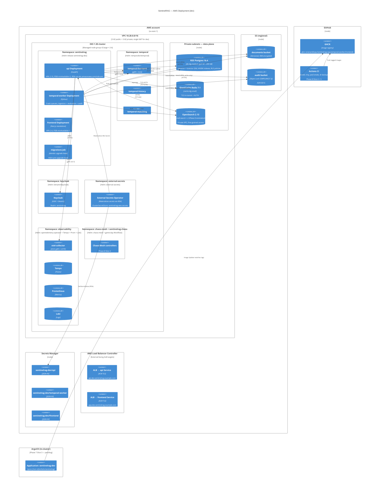

# C4 L4 — AWS Deployment

How the L2 containers map onto a real AWS environment provisioned by `infra/terraform/aws/` and deployed by `infra/helm/sentinelrag/`.

## What Terraform owns vs what Helm owns

| Layer | Tool | Examples |
|---|---|---|
| Account-level | Terraform | VPC, EKS cluster + node group, OIDC provider, RDS, ElastiCache, OpenSearch, S3 buckets, Secrets Manager parents, IRSA roles, ACM certs |
| Cluster-level | Helm (separate releases) | Chaos Mesh, External Secrets Operator, ArgoCD, Temporal, Keycloak, AWS Load Balancer Controller, cert-manager, OTel + Tempo + Prom + Loki |
| Application-level | Helm (sentinelrag chart) | api / worker / frontend Deployments + SAs + ConfigMaps + Services + Ingresses + HPA + PDB + NetworkPolicies + ExternalSecret + migrations Job |

**Boundary rule:** account-level resources are Terraform, anything inside the cluster is Helm. The boundary is explicit so a `terraform destroy` cannot wipe ArgoCD's state, and a `helm uninstall` cannot delete the audit bucket.

## Phase status note

The cluster bootstrap charts (Chaos Mesh, ESO, ArgoCD, Temporal, ALB controller, cert-manager) are listed because they are required for the diagram to be true; their installation is **Phase 7 Slice 3**, currently pending. The SentinelRAG chart and Terraform are both shipped and clean.

## Related ADRs

- [ADR-0011](../adr/0011-multi-cloud-strategy.md) — AWS primary, GCP mirror
- [ADR-0012](../adr/0012-helm-argocd-deployment.md) — Helm + ArgoCD
- [ADR-0023](../adr/0023-helm-chart-shape.md) — Helm chart shape
- [ADR-0024](../adr/0024-terraform-layout.md) — Terraform layout
- [ADR-0028](../adr/0028-disaster-recovery.md) — DR; the failover target diagram is `L4-deployment-gcp.md`
